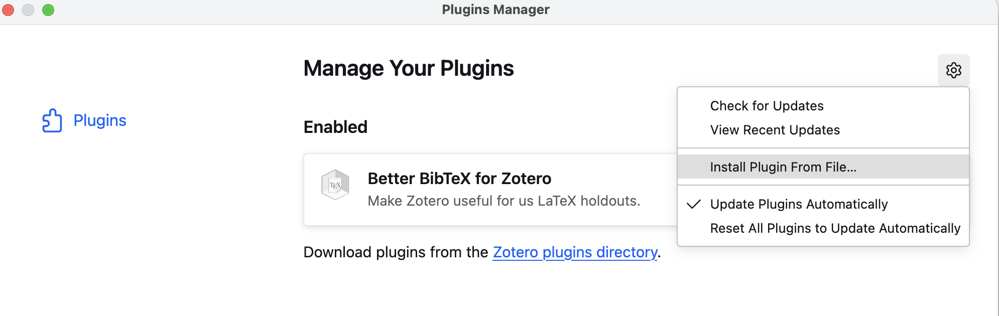
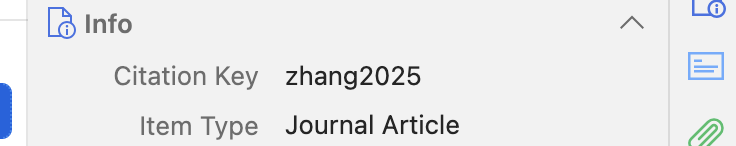
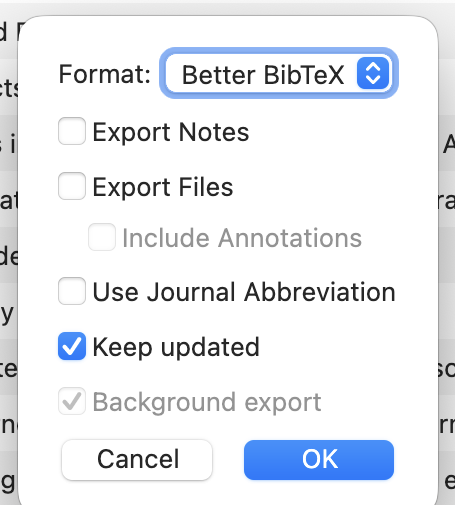

# Setup guide — from zero to automatic citations (once, ~30–45 min)

*Written for someone who has never used Zotero, Pandoc, or a plugin. Every step ends with what you should see, so you know it worked. If a menu looks different on your screen (these tools update regularly), the linked official page is the always-current source.*

> **Who does what.** Your part is the **clicks inside the Zotero app** — Steps 1–4 below, plus pinning (Claude can't click inside Zotero for you). The terminal work — **installing Pandoc and rendering — Claude does for you** when you say *"set up automatic citations for me"*; Steps 5–6 are just a line telling you what to ask. *(Prefer to run the whole thing by hand, without Claude? The [starter-kit README](../starter-kit/README.md) has the commands.)*

## The idea in one paragraph

Three helpers. **Zotero** is your library catalogue — you drop a PDF in, it fetches the paper's details (authors, year, journal, DOI). **Better BibTeX** gives every paper a permanent ID card — a short *citekey* like `cheng2026`. **Pandoc** is your typesetter — you write your draft in a plain-text file, cite by ID (`[@cheng2026]`), and at the press of a button it produces a Word document where every ID has become a proper citation — *(Cheng et al., 2026)* — with a perfectly matched reference list at the end. You never format a citation by hand again, and the text and the list can never disagree.

**What it does *not* do:** it will happily format a *wrong* citation beautifully. Choosing real, on-point, actually-read sources stays your job.

---

## Step 1 — Install Zotero
1. Download from **[zotero.org/download](https://www.zotero.org/download/)** (free; Mac/Windows/Linux). You do **not** need an account or syncing for this workflow — everything runs on your own computer.
2. Open it. **You should see:** an empty library window with a left-hand folder pane.

## Step 2 — Install the Better BibTeX plugin (the fiddly step — once only)
Zotero has no in-app plugin store, so this is a manual download:
1. Go to the plugin's release page: **[github.com/retorquere/zotero-better-bibtex/releases/latest](https://github.com/retorquere/zotero-better-bibtex/releases/latest)** and download the **`.xpi`** file.
   ⚠ **Firefox users: right-click → "Save Link As…"** — left-clicking makes Firefox try (and fail) to install it as a browser extension.
2. In Zotero: **Tools → Plugins → click the gear icon (top-right) → "Install Plugin From File…"** → choose the downloaded `.xpi` → Install → restart Zotero. *(Official instructions: [retorque.re/zotero-better-bibtex/installation](https://retorque.re/zotero-better-bibtex/installation/).)*

   
   *The gear menu you're looking for — after installing, Better BibTeX shows under "Enabled" (and updates itself automatically from then on).*
3. **You should see:** Zotero restarts without an error message. (The visible proof comes in the next step: after you add your first paper, clicking it shows a **Citation Key** row — e.g. `smith2024` — in the right-hand pane.) Good news: the plugin **auto-updates itself from now on**; you'll never repeat this step.

## Step 3 — Add your first papers
1. Drag a paper's PDF into the Zotero window. **You should see:** a new entry with authors, year, title auto-filled (Zotero reads the PDF's metadata).
2. **Glance at the year and DOI now.** A missing year prints as "n.d." in your manuscript later; fixing it takes 5 seconds here.
3. Note the paper's **Citation Key** — that's what you'll type in your draft.

   
   *In the right-hand Info pane of a selected paper: the **Citation Key** row (here `zhang2025`) is the ID you'll cite with.*

## Step 4 — The auto-updating export (the magic — and gotcha #1)
This creates one file, `library.bib`, that always mirrors your library. Your renderer reads it.
1. Right-click your library (or a collection) → **Export Library…**
2. Format: **Better BibTeX**. Tick ☑ **"Keep updated."**
3. Save it as **`library.bib` inside your project's `starter-kit/` folder** (or wherever your render script lives) — i.e. *directly where it will be read*, replacing the sample file.
4. In Zotero **Settings → Better BibTeX**, set automatic export to **"on idle"** (so it doesn't re-export on every keystroke).

   
   *The export dialog: Format = **Better BibTeX**, ☑ **Keep updated** — the two settings that make the library file maintain itself.*

5. **You should see:** a `library.bib` file in your `starter-kit/` folder — and its *Date Modified* updates by itself shortly after you edit anything in Zotero. That's the "Keep updated" export working.

> **Gotcha #1 (cost us a morning):** if the exported file and the file your renderer reads are *two different files*, everything silently goes stale — new papers show up as errors even though "they're in Zotero." One export, saved straight to where it's used.

## Step 5 — Pandoc: nothing for you to do
Pandoc is the "typesetter" that turns your draft into a Word document. **Claude installs it for you** when you ask it to set up the workflow — you never open a terminal. *(Setting it up by hand instead? The install, one line per operating system, is in [troubleshooting](03-troubleshooting.md).)*

## Step 6 — See it work
**Ask Claude: _"render the sample draft."_** It runs the demo and shows you the result — open the new `sample-draft.docx` and you'll see formatted citations and a matched reference list. That's the whole pipeline working end to end. Setup complete; from here it's [the daily workflow](02-daily-workflow.md).

## Pin your citekeys — the habit that saves your drafts
Citekeys are *derived from* a paper's metadata — so correcting a year can silently change the key and break every `[@key]` you've already written. Prevention: right-click an item (or select all) → **Better BibTeX → Pin citation key**. Pinned keys never change.

**Make it a habit — after *any* manual change in Zotero** (adding a paper, merging duplicates, fixing a year/author): **pin the key → let the export refresh → re-render once.** Zero warnings on the render is your confirmation nothing broke. *(Format note: a pin is the line `Citation Key: yourkey` in the item's **Extra** field — exactly that format; bare text there does nothing and can even erase an existing pin.)*
