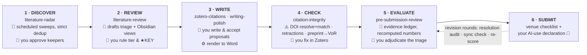
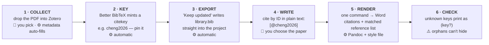

# CLAS — how the toolkit fits together

Six skills stationed along one research lifecycle: **you keep every judgement call, Claude operates the machinery, and nothing is written without your yes.** (Built on Zotero + Better BibTeX + Pandoc + Claude Code; style = APA 7th or any journal's.)

**Legend:** 👤 you — judgement · 🤖 Claude — drafts, checks, audits, never invents · ⚙️ automatic — tools · ⚠️ built-in check

## The research lifecycle — where each skill works

*Every station also works alone — check citations without a matrix, review a draft without a radar, polish a paragraph any time. The lifecycle is the map, not a required march.*

## The citation pipeline underneath (set up once — it feeds every stage)

## Claude Code — the built-in operator

Claude runs the toolkit with you — bookkeeping and vigilance, never invention (docs 00–08 = the manual Claude follows; every step is inspectable):

- **Set-up:** installs and wires the tools per project (no-admin setups included), copies the starter-kit, verifies the sample render — then walks you through the few Zotero clicks it can't do for you.
- **Discovery & review:** radar sweeps, dedup, drafted triage rows and generated vault views — every judgement call queued for your approval, never written silently.
- **Render & report:** runs the renders, reads every warning, explains orphans in plain language.
- **Verification:** DOI resolve-and-match, retractions, preprint→version-of-record; manuscript evidence ledgers with recomputed statistics and page anchors; then a fresh agent re-checks the review itself before you see it.
- **Second opinions (optional — your key, your call, per run):** a different vendor's model re-judges review rows or the whole manuscript evaluation, propose-only; pinned models are re-verified on a schedule so a retired ID never silently breaks an audit.

## The standing rules

| | |
|---|---|
| **Judgement stays human** | What to read, cite, tier, and claim is yours; approval gates sit before every write, and interpretation questions are routed to you, never settled by a model. |
| **Flag, never guess** | Nothing is invented, "remembered", or silently corrected — the 16-rule integrity charter ([docs/04](04-citation-integrity.md)) is the single source, and fixes are proposals you apply in Zotero. |
| **Errors surface, they don't lurk** | `(key?)` warnings at every render; PASS/FAIL ledgers on every checkable number; dashboards that count what changed. |
| **One reading is never trusted alone** | Fresh-agent verification comes standard; optional cross-vendor audits show you the spread between two independent reads. |

---

*Prefer a designed, printable one-pager? [flowchart.html](flowchart.html) is the same picture with full styling — GitHub shows HTML as code, so open it after downloading the ZIP (just double-click the file). Companion: docs/00–08 + the starter-kit/ folder. Last verified July 2026.*
